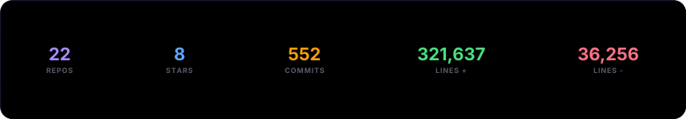
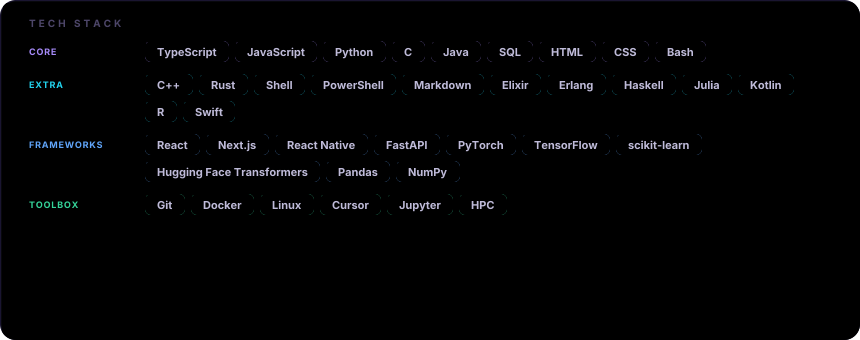

<picture>
  <source media="(prefers-color-scheme: dark)" srcset="https://raw.githubusercontent.com/jakubkalinski0/jakubkalinski0/output/github-contribution-grid-snake-dark.svg" />
  <source media="(prefers-color-scheme: light)" srcset="https://raw.githubusercontent.com/jakubkalinski0/jakubkalinski0/output/github-contribution-grid-snake.svg" />
  
</picture>

 

Lines +/−: sum of your additions/deletions from <a href="https://docs.github.com/en/rest/metrics/statistics?apiVersion=2022-11-28#get-all-contributor-commit-activity">contributor stats</a> (default branch) across repos. Public repos only unless you add repo secret <code>PROFILE_LINE_STATS_TOKEN</code> (PAT with <code>repo</code> read). · powered by <a href="https://github.com/collectioneur/readme-aura">readme-aura</a>

