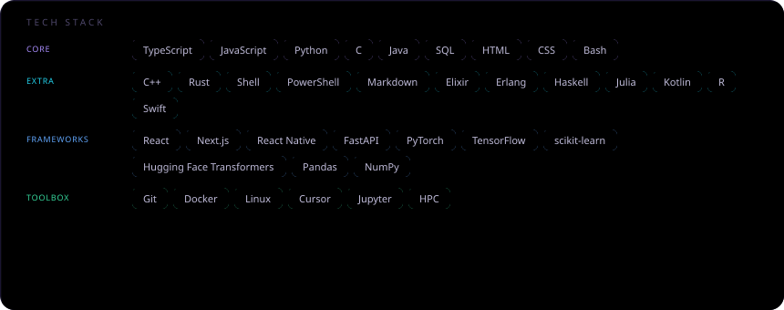

<!-- Tekst pod nazwą: pole Bio z profilu GitHub (Settings → Public profile). Czcionka NotoSans + .github/fonts (workflow) żeby działały polskie znaki w SVG. -->

<picture>
  <source media="(prefers-color-scheme: dark)" srcset="https://raw.githubusercontent.com/jakubkalinski0/jakubkalinski0/output/github-contribution-grid-snake-dark.svg" />
  <source media="(prefers-color-scheme: light)" srcset="https://raw.githubusercontent.com/jakubkalinski0/jakubkalinski0/output/github-contribution-grid-snake.svg" />
  
</picture>

 

<strong>Repos / Stars</strong> (CI): repos you <em>own</em> (paginated). <strong>Lines ±</strong>: <a href="https://docs.github.com/en/rest/metrics/statistics?apiVersion=2022-11-28#get-all-contributor-commit-activity">contributor stats</a> on those repos only (default branch). <strong>Commits</strong>: max( sum of your weekly commit counts there , <a href="https://docs.github.com/en/rest/search/search#search-commits"><code>search/commits?q=author:…</code></a> <code>total_count</code> ) so work on org/other people’s repos can count too — still not “every git commit ever” (private visibility, e-mail ↔ GitHub account, API limits). PAT <code>PROFILE_LINE_STATS_TOKEN</code> for private owned repos. · powered by <a href="https://github.com/collectioneur/readme-aura">readme-aura</a>

